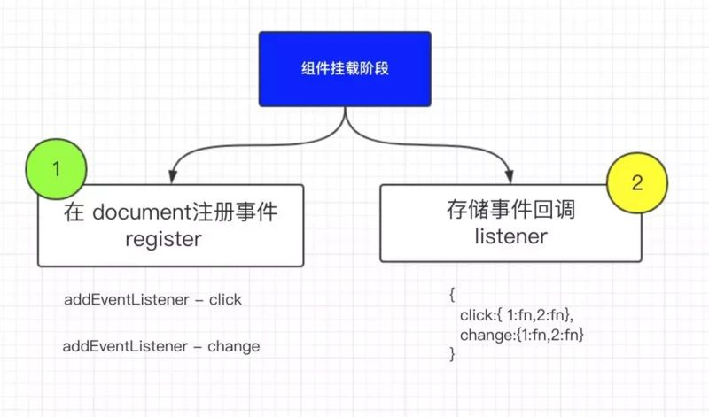

### 是什么/意义
合成事件是React基于原生事件模拟一套事件机制，包含事件冒泡、捕获等特性。
* 减少内存消耗提升性能，不需要注册那么多的事件了，一种事件类型只在 document上注册一次
* 统一规范，解决 ie 事件兼容问题，对开发者友好
* 对原生事件的升级和改造，如onchange(原生是失去焦点才执行)

## 事件机制

### SyntheticEvent
SyntheticEvent是react合成事件的基类，定义了合成事件的基础公共属性和方法。使用了对象池来管理SyntheticEvent实例化和销毁
react会根据当前的事件类型来使用不同的合成事件对象，比如鼠标单机事件 - SyntheticMouseEvent，焦点事件-SyntheticFocusEvent等，但是都是继承自SyntheticEvent。

### 触发

1. 触发dispatchEvent，并开启批量更新
2. 创建SyntheticEvent并找到所有要触发的事件(冒泡/捕获),从元素所在的实例hostParent一直循环到最外层实例
    2.1 实例化SyntheticEvent
    2.2 提取捕获+冒泡上的事件(从listenerBank中找事件)，
        listenerBank = { click:{ .1:()=>{} }}
    2.3 将[...捕获,...冒泡]绑定到SyntheticEvent的_dispatchListeners上
3. 执行事件对象listeners
4. 释放SyntheticEvent对象

### 注册
 组件挂载阶段，根据组件内的声明的事件类型-onclick，onchange 等
1. 注册事件（document)
    在document上注册要绑定事件的类型，同类型事件只绑定一次,指定统一的事件处理程序 dispatchEvent
2. 存储事件(listenerBank)
    缓存事件函数，listenerBank = { click:{ .1:()=>{},.2:()=>{} }}

***
## ask
### 冒泡关系
* 执行顺序
    * dom原生->react事件->document原生
* setState
    * 合成事件里执行setState效果是异步的，因为开启了批量更新
* 阻止冒泡
    * e.stopPropagation只能阻止react事件冒泡，无法阻止原生事件
    * e.nativeEvent.stopPropagation会阻止react和原生事件

### SyntheticEvent对象
采用了事件池，大大节省了内存，不会频繁创建和销毁对象

### 可以原生和合成事件混用吗
最好不要，如果有原生dom节点不小心阻止了事件冒泡 ，会导致该节点绑定的合成事失效

### 区别
* 命名不同onClick， click
* 阻止原生事件冒泡，需要e.nativeEvent.stopPropagation
### 推荐
React自己实现了一套高效的事件注册、存储、分发和重用逻辑，模拟了事件捕获、冒泡机制
* [推荐文章](http://cycle263.github.io/blogs/framework/React/implement/event.html)
* [2](https://toutiao.io/posts/28of14w/preview)